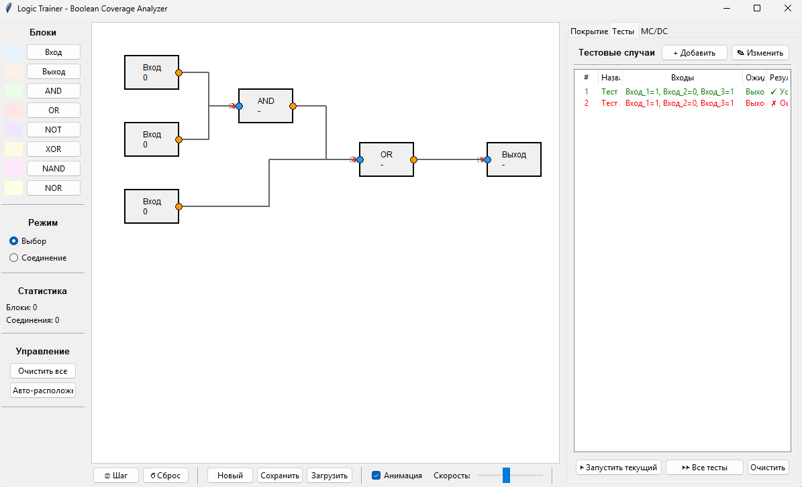

# 🧠 Logic Trainer
# Ридми написан ИИшкой. Код функционален, но UI сырое. Я поправлю подпись числа входящих связей в блок и автовыравнивание добавления блков как будет время. Вкладка MC/DC резервная, позже допилю функциональность которая позволит сохранять описание к загружаемой схеме
**Интерактивное приложение для моделирования, тестирования и анализа логических схем с поддержкой DO-178C Level A и MC/DC**

---

## 📖 О проекте

Logic Trainer — это мощный инструмент для визуального проектирования логических схем с возможностью тестирования и анализа покрытия по стандартам авиационной сертификации **DO-178C Level A** и **MC/DC** (Modified Condition/Decision Coverage).

### 🎯 Основные возможности

- **Визуальное проектирование** — создание схем из логических элементов (AND, OR, NOT, XOR, NAND, NOR)
- **Симуляция** — пошаговое и непрерывное распространение сигналов
- **Тестирование** — создание наборов тестов с проверкой ожидаемых результатов
- **Анализ покрытия**:
  - Decision Coverage — покрытие веток True/False
  - MC/DC — независимое влияние каждого входа на выход
  - DO-178C Level A — полное соответствие авиационному стандарту
- **Сохранение и загрузка** — схемы и тесты сохраняются в JSON или бинарном формате

---

## 🚀 Быстрый старт

### Требования

| Компонент | Версия |
|-----------|--------|
| Python | 3.8 или выше |
| pip | 22.0 или выше |
| Tkinter | Встроен в Python |

### Установка

*Клонирование репозитория:*

    git clone https://github.com/yourusername/Logic_Trainer.git
    cd Logic_Trainer

*Создание виртуального окружения:*

    python -m venv .venv

*Активация окружения:*

Windows:

    .venv\Scripts\activate

macOS/Linux:

    source .venv/bin/activate

*Запуск приложения:*

    python main.py

### Решение проблем с активацией в PowerShell

Если возникает ошибка "выполнение сценариев отключено в этой системе", выполните:

    Set-ExecutionPolicy -ExecutionPolicy RemoteSigned -Scope CurrentUser

---

## 📂 Структура проекта

    Logic_Trainer/
    ├── logic_trainer/
    │   ├── core/                    # Ядро логики
    │   │   ├── block.py            # Логические блоки и соединения
    │   │   ├── simulator.py        # Симулятор распространения сигналов
    │   │   ├── test_cases.py       # Система тестов
    │   │   ├── mcdc_analyzer.py    # MC/DC анализ входов
    │   │   ├── decision_mcdc_analyzer.py  # DO-178C Level A
    │   │   └── coverage.py         # Объединенный анализ покрытия
    │   │
    │   ├── ui/                      # Пользовательский интерфейс
    │   │   ├── canvas.py           # Графический холст
    │   │   ├── toolbar.py          # Панель инструментов
    │   │   ├── properties.py       # Свойства блоков
    │   │   ├── test_table.py       # Таблица тестов
    │   │   ├── coverage_panel.py   # Анализ покрытия
    │   │   └── mcdc_panel.py       # MC/DC панель
    │   │
    │   └── utils/                   # Вспомогательные модули
    │       ├── geometry.py         # Геометрические утилиты
    │       └── serialization.py    # Сохранение/загрузка
    │
    ├── main.py                      # Точка входа
    └── requirements.txt             # Зависимости

---

## 🛠️ Руководство пользователя

### 1. Создание схемы

**Добавление блоков**

В левой панели нажмите кнопку нужного блока:
- *Вход* — INPUT (источник сигнала)
- *Выход* — OUTPUT (результат)
- *AND, OR, NOT, XOR, NAND, NOR* — логические операции

Блок автоматически появится на холсте. Перетащите блок зажатой левой кнопкой мыши.

**Создание соединений**

1. Нажмите на *выходной порт* (оранжевый кружок справа) блока-источника
2. Появится пунктирная линия
3. Нажмите на *входной порт* (синий кружок слева) блока-приемника
4. Соединение создано

**Управление схемой**

| Действие | Результат |
|----------|-----------|
| Двойной клик по блоку INPUT | Переключение значения (0 ↔ 1) |
| Delete | Удалить выбранный блок |
| Очистить все | Удалить всю схему |
| Авто-расположение | Автоматическое выравнивание блоков |

### 2. Симуляция

**Запуск симуляции**

1. Установите значения входов (двойной клик по блоку INPUT)
2. Нажмите *▶* (Single Step) для пошагового распространения
3. Или нажмите *▶▶* (Continuous) для полной симуляции

**Визуализация**

| Цвет | Значение |
|------|----------|
| Зеленый | TRUE (1) |
| Красный | FALSE (0) |
| Серый | Не определено |

### 3. Тестирование

**Создание теста**

1. Перейдите на вкладку *Тесты*
2. Нажмите *+ Добавить*
3. Заполните диалог:
   - *Название теста* — описание (например, "A=1, B=0")
   - *Входные значения* — установите чекбоксы для INPUT блоков
   - *Ожидаемые выходы* — установите чекбоксы для OUTPUT блоков
4. Нажмите *Добавить*

**Запуск тестов**

| Кнопка | Действие |
|--------|----------|
| ▶ Запустить текущий | Выполнить выбранный тест |
| ▶▶ Все тесты | Выполнить все тесты и запустить анализ |

**Статус тестов**

| Статус | Описание |
|--------|----------|
| ✓ Успех | Результаты совпадают с ожидаемыми |
| ✗ Ошибка | Несоответствие результатов |
| ○ Не запущен | Тест еще не выполнялся |

### 4. Анализ покрытия

**Вкладка Decision Coverage**

Показывает для каждого блока, были ли активированы ветки TRUE и FALSE.

| Статус | Описание |
|--------|----------|
| FULL | Обе ветки (TRUE и FALSE) покрыты |
| PARTIAL | Покрыта только одна ветка |
| NONE | Ни одна ветка не покрыта |

**Вкладка MC/DC (Branch)**

Показывает для каждого блока:
- *Входы MC/DC* — сколько входов имеют MC/DC пары
- *Ветки* — символы T (TRUE) и F (FALSE)
- *Статус MC/DC* — уровень покрытия

**Вкладка DO-178C Level A**

Полный отчет о соответствии стандарту с рекомендациями по улучшению покрытия.

*Для соответствия DO-178C Level A необходимо:*
1. Все ветки каждого блока покрыты (100% Decision Coverage)
2. Каждый вход каждого блока имеет MC/DC пару

### 5. Сохранение и загрузка

**Сохранение схемы**

1. Нажмите *Файл → Сохранить как...*
2. Выберите формат:
   - *JSON* — человекочитаемый формат
   - *.logic* — бинарный формат (pickle)

**Загрузка схемы**

1. Нажмите *Файл → Открыть...*
2. Выберите файл схемы (.json или .logic)

> **Примечание:** Тесты сохраняются вместе со схемой.

---

## 📊 Пример работы

### Схема: (A AND B) OR C

*Схематическое представление:*

    A ─────┐
           ├── AND ───┐
    B ─────┘          ├── OR ─── OUTPUT
    C ─────────────────┘

### Тестовые случаи

| # | Название | A | B | C | Ожидаемый выход |
|---|----------|---|---|---|-----------------|
| 1 | Все False | 0 | 0 | 0 | 0 |
| 2 | A=True, B=False, C=False | 1 | 0 | 0 | 0 |
| 3 | A=True, B=True, C=False | 1 | 1 | 0 | 1 |
| 4 | A=False, B=False, C=True | 0 | 0 | 1 | 1 |

### Результат анализа DO-178C

*Decision Coverage: 100% (все ветки покрыты)*

*MC/DC покрытие: 100% (все входы влияют на выход)*

*DO-178C Level A: ✅ СООТВЕТСТВУЕТ*

---

## ❓ Часто задаваемые вопросы

**Почему блок не меняет цвет при симуляции?**

Убедитесь, что у блока есть значение на всех входах. Если хотя бы один вход не определен, блок не может вычислить результат.

**Как создать сложную схему?**

Используйте промежуточные логические блоки. Выход одного блока может быть входом другого. Количество уровней вложенности не ограничено.

**Почему тест показывает "Ошибка"?**

Проверьте ожидаемые выходы — они должны соответствовать реальным результатам симуляции. Убедитесь, что все INPUT блоки имеют значения в тесте.

**Как интерпретировать MC/DC анализ?**

MC/DC требует, чтобы для каждого входа была пара тестов:
1. Отличающихся *только этим входом*
2. С разными значениями выхода схемы
3. Если такой пары нет — вход не покрыт MC/DC

**Что означает "Не соответствует DO-178C Level A"?**

Это означает, что хотя бы один блок не соответствует требованиям:
- Не все ветки покрыты (TRUE/FALSE)
- Не все входы имеют MC/DC пары
- Нужно добавить тесты для покрытия недостающих веток или входов

---

## 🛠️ Устранение проблем

**Проблема:** `python` не найдена

Windows:

    where python

macOS/Linux:

    python3 --version

**Проблема:** Ошибка активации venv в PowerShell

    Set-ExecutionPolicy -ExecutionPolicy RemoteSigned -Scope CurrentUser

**Проблема:** `tkinter` не найден

Linux (Ubuntu/Debian):

    sudo apt install python3-tk

macOS:

    brew install python-tk

**Проблема:** Ошибка импорта модулей

Убедитесь, что вы в корне проекта:

    pwd  # /path/to/Logic_Trainer

Переустановите зависимости:

    pip install -r requirements.txt --upgrade

---

